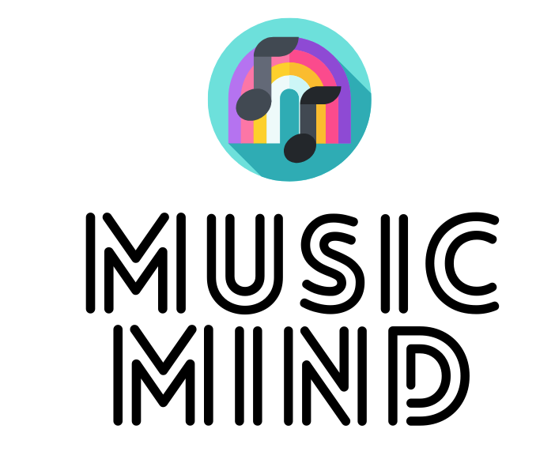

# Musicmind [](https://forthebadge.com)
> A web based classical Mastermind game, with added color and pitch
> challenge mode. Implemented with Spring by Claire Fan.
## 🚩 Table of Contents

- [Introduction](#Introduction)
- [Install](#Install)
- [Architecture](#Architecture)
- [Todo](#Todo)
- [Maintainer](#Maintainer)
- [FAQ](#FAQ)
- [License](#License)

## 📕 Introduction
### 💎 Value of this App
This is a logic game which helps people build critical thinking and inference skills. 
However, the majority of logic games in the market are unconsciously biased towards using 🔢
`numbers` or 🔤 `letters` as symbol for inference.

There are many people actually recognize 🌈 `color` or 🎶 `sound` as symbols more efficiently. 
Little ones who really like colors. Musicians like me has perfect pitch would like to play 
around with sound patterns.

Bringing **diversity** into our project, we add colors and sounds as new symbols in this game 
for enriching user experience in our game.

### 🐾  Game Rule
MusicMind app is a board / decode game adapted from an old British game called `🐂s and 🐄s`.
The idea of the game is for one player (the code-breaker) to guess the secret code chosen by the 
other player(the code-maker).  

The code is a sequence of 4 digits chosen from 0 ~ 9. Then, the code-breaker makes a serie of 
pattern guesses. **The number can be picked repetitively**. After each guess the code-maker gives 
feedback in the form of 2 numbers.
If 
the matching digits are in the right position, you earn a 🐂, if in different positions, you earn 
a 🐄.  The code-breaker wins the game by getting the secret number ( earn 4 🐂s in one round ) 
within 10 tries.

For example:  
* Secret number: 1357  
* Player's try: 1538  
* Answer: 1 🐂 and 2 🐄s (The bull is "1", the cows are "2" and "5".)  

### 🎨  New Features with Examples 
Following the playing rule of `🐂s and 🐄s`, MusicMind develop two more features into 
this game, 
decode the color pattern, and the sound pattern.

Users can choose the symbols used for the game:
* **Number, color and pitch** : The default setting of the application is to play both with 
  color and sound.


* **Number and pitch** : Disable the color through clicking the `With Color` and turn it into 
  `Without Color`.
  


* **Color and pitch** : Disable the number through clicking the `With Number` and turn it into 
  `Without Number`.


* **Pitch only** : Disable both number and sound, and make the presentation board with a dark color.
  

  


For making this game more friendly to everyone, this app opened two difficulty level for users
to pick from :
* **Easy Level** : The secret number / color / sound pattern is picked from 8 candidates.
  It means there are `4096` possible combinations.
* **Hard Level** : The secret number / color / sound pattern is picked from 10 candidates.
  It means there are `10000` possible combinations.


## 🔧 Install (Linux/Mac)

### Pre-Installation Requirements

- [x] Setup Java Development Kit (JDK version 11 or later)

### Get Started
Run the following commands in a terminal.
```
mkdir musicmind
cd musicmind
git clone https://github.com/clairefan816/game-coding-challenge.git .
./mvnw spring-boot:run
```
Now you can play the game from any browser by connecting to ```http://localhost:8080```

Please remember to wear your 🎧 headphone or turn on 🎛️ audio.

### Additional libs used in this application
* Lambok Plugin
* SLF4J(Simple Logging Facade for Java)
* Mockito
* JUnit4

## 🧬 Architecture
This project follows the Spring MVC framework because the model-view-controller architecture 
and the ready components offered by Spring can be used to develop a flexible and loosely coupled 
web application.

The main REST APIS developed in the application serves for main functionalities of this 
game, including creating new game, retrieving a game, and checking game results.

Here are the three main endpoint URLs:
```URL
HTTP method: POST  CRUD: Create  ACTION: Create a new game
/v1/mindmaster/game

HTTP method: GET  CRUD: Read  Action: Returns a request game
/v1/mindmaster/game/{gameId}

HTTP method: POST  CRUD: Create  ACTION: Returns a game with answer checked result
/v1/mindmaster/game/guess
```


This below is the detailed structure of this application:


* The **Model**  encapsulates the application data in the form of POJO. Besides, with **Lambok 
  library** (java library ) plugin for reducing "infrastructural code".
  
  
* The **Service** includes all business logics, such as creating the random secret number, as 
  well as calculating the guess result.


* The **Controller** is responsible for taking **User Request** and calls the appropriate 
  service methods. Here are three main RestAPIs:
  
  ```Java
  @PostMapping("/game")
    public ResponseEntity<Game> startNewGame(@RequestBody PlayerPreference playerPreference) throws IOException, InterruptedException, NoResponseException {
        if (!Constants.ALLOWED_LEVELS.contains(playerPreference.getPreference())){
            throw new BadRequestException(String.format("Game level must be one of: %s",
                    String.join(", ", Constants.ALLOWED_LEVELS)));
        }
        return ResponseEntity.ok(gameService.createGame(playerPreference));
    }
  ```
  ```Java
  @PostMapping("/game/guess")
    public ResponseEntity<Game> gamePlay(@RequestBody GameGuess gameGuess) throws InvalidGameException, NotFoundException, InvalidGuessException {
        Game game = gameService.playGame(gameGuess);
        return ResponseEntity.ok(game);
    }
  ```
  ```Java
  @GetMapping("/game/{gameId}")
    public ResponseEntity<Game> retrieveOneGame(@PathVariable String gameId) throws InvalidParamException {
        return ResponseEntity.ok(gameService.retrieveGame(gameId));
    }
  ```
* The **Storage** have used the data structure of `HashMap` for storing the GameId and the Game 
  object in pairs in **Java Memory**. It implements the **Thread safe singleton patten** for 
  saving the memory of application, as well as keeping the thread safe when revising the data.
  
  
* The **View** is organized with `HTML`, `CSS`, and some `JQuery`.


* The **Test** includes **unit testing**, **integration testing**, and **user acceptance 
  testing**.  
  The **unit test** mainly tests the business logic in service layer with `JUnit4` and `Mockito`.  
  The **integration test** mainly tests the web layer REST APIs with `MockMvc` and `Mockito`.  
  The **user acceptance test** mainly tests how my application be accepted by real users. We 
  have offered this application to three users for getting user feedbacks.
  


## 🤸 Todo
* Should add assistance tool that helps player remove impossible choices
* Add history and allow user see results of past games
* Create an android client for the game

## 👩‍💻 Maintainer
[Claire Fan](mailto:clairefan816@gmail.com)

## 💬 FAQ
### It seems something wrong on your app?

If you find a bug (the website couldn't handle the query and gaven undesired results), kindly 
open an issue [here](https://github.com/clairefan816/game-coding-challenge/issues/new). Please 
include sample queries and their corresponding results.

## 📜 License